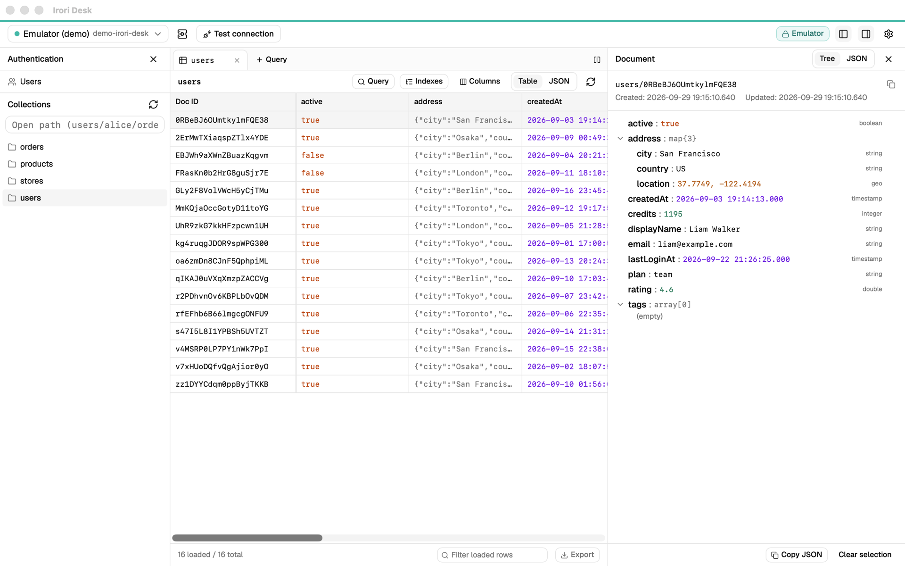
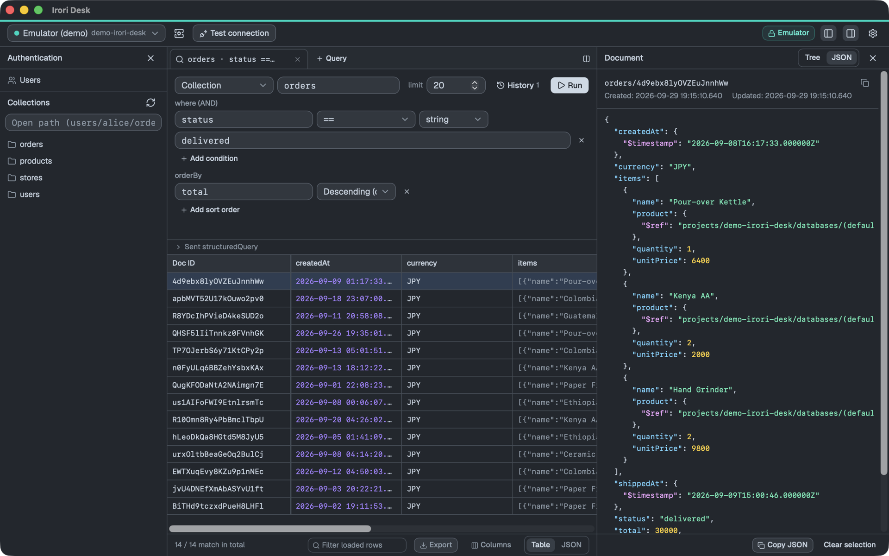
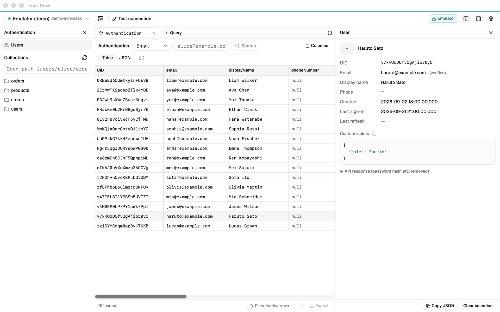
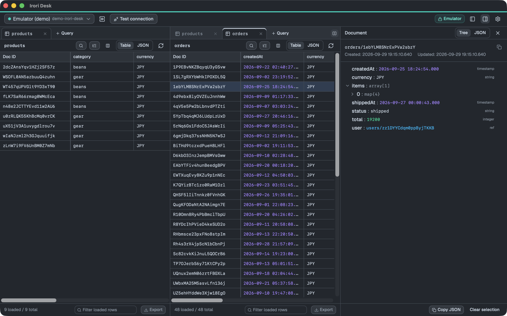

# Irori Desk

English | [日本語](docs/README.ja.md)

A desktop app for browsing and querying Cloud Firestore and Firebase Authentication (Tauri 2 + React).
The current version is **read-only**: it never calls any API that writes to Firestore or Authentication.



<table>
  <tr>
    <td width="33%"></td>
    <td width="33%"></td>
    <td width="33%"></td>
  </tr>
  <tr>
    <td align="center">Queries (dark theme)</td>
    <td align="center">Authentication users</td>
    <td align="center">Split view</td>
  </tr>
</table>

## Download

Get the latest version from [GitHub Releases](https://github.com/sugumura/IroriDesk/releases/latest).

| OS | File | Notes |
|---|---|---|
| macOS 11+ (Apple Silicon / Intel) | `IroriDesk_<version>_universal.dmg` | Signed and notarized |
| Windows 10 / 11 (x64) | `IroriDesk_<version>_x64-setup.exe` or `_x64.msi` | Not code-signed yet — see below |

The Windows installers are not signed yet (we are setting up signing with the SignPath Foundation, see [CODE_SIGNING.md](CODE_SIGNING.md)). Windows SmartScreen may show "Windows protected your PC"; click **More info → Run anyway**.

## Features

- **Browse**: collection tree, document list (paging, virtual scrolling), document details (tree / JSON), jump to subcollections and referenced documents
- **Query**: `where` (AND), `orderBy` and `limit` on a collection or collection group. Field name suggestions, a link to create a missing composite index, and per-connection history (last 20)
- **Authentication**: user list, search by UID / email / phone number, details (providers, custom claims, …)
- **Indexes**: composite indexes and single-field exemptions per collection
- **Export**: JSON (keeps type information) / CSV / TSV
- **View**: pinned Doc ID column, column visibility and order, split view (side by side / stacked), light / dark / system theme, fonts and zoom, English / Japanese
- **Connections**: production (ADC, or a gcloud account per connection) and the Firebase Emulator

The specification and design decisions (in Japanese) are in [docs/SPEC.md](docs/SPEC.md).

## Support

Irori Desk is free. If it saves you time, you can support its development:

[](https://ko-fi.com/sugumura)
[](https://www.buymeacoffee.com/sugumura)

The same links are in the app under **Settings**, the command palette (⌘K), and the **Help** menu on macOS.

## Requirements

| Tool | Used for | Notes |
|---|---|---|
| Node.js 24 / pnpm 10 | Frontend | |
| Rust (stable) | Backend | Install with `rustup` |
| Xcode Command Line Tools (macOS) | Build | You may need `sudo xcodebuild -license accept` once |
| Google Cloud SDK (gcloud) | Authentication for production connections | |
| Java 21+ | Firebase Emulator | Only for development. See `.sdkmanrc` |

For Windows / Linux, see the [Tauri prerequisites](https://tauri.app/start/prerequisites/).

## Getting started

```bash
pnpm install
pnpm tauri dev
```

## Connecting to a production project

Open **Manage connections** (the server icon in the top bar), add a **Production (Google Cloud)** connection, and choose an account.

### Using ADC

One account for the whole machine.

```bash
gcloud auth application-default login --scopes=openid,https://www.googleapis.com/auth/userinfo.email,https://www.googleapis.com/auth/cloud-platform
```

- Without `--scopes`, gcloud also requests a Cloud SQL scope, which this app doesn't need.
- After recreating ADC with a different account, press **Reload ADC** in Manage connections (no restart needed).

### Using a gcloud account

Each connection can use a different account. **Add account** in Manage connections opens a browser to sign in with Google (it runs `gcloud auth login --no-activate`, so the active account of your gcloud CLI doesn't change). If a token expires or your organization requires reauthentication, press **Sign in again**.

### Notes

- Access tokens are kept only in memory on the Rust side; they are never passed to the UI or written to the settings file.
- The Firebase Authentication API requires a quota project when called with user credentials, so the connection's project is used unless you set one (`x-goog-user-project`).
- If Authentication isn't enabled for the project, you'll get `CONFIGURATION_NOT_FOUND`. Click **Get started** under Authentication in the Firebase console.
- For queries that need a composite index, the error includes a link to create it.
- Viewing indexes requires permission to list indexes (e.g. Owner or Datastore Index Admin). The Emulator doesn't support the index API.

## Trying it with the Emulator

```bash
sdk env            # switch to Java 21 (if you use sdkman)
pnpm emulator      # Firestore (8080) and Authentication (9099)
pnpm seed          # load test data (128 documents, 33 users)
```

On first launch the app creates an "Emulator (demo)" connection (project ID `demo-firestore-viewer`).
The test data includes nested maps, arrays, Timestamps, References, GeoPoints, bytes, integers outside the safe range, NaN, keys starting with `$`, missing parent documents, subcollections, and 120 documents for paging.

You can load the same Firestore test data into a production project as well (existing documents are never overwritten; Authentication users are not created):

```bash
pnpm seed --project <projectId>
```

## Tests

```bash
pnpm test                                         # frontend (vitest)
pnpm typecheck
cd src-tauri && cargo test                        # Rust
cd src-tauri && cargo test -- --include-ignored   # also run Emulator integration tests (needs pnpm emulator and pnpm seed)
cd src-tauri && cargo clippy --all-targets
```

## Release builds

### Unsigned (for your own Mac)

```bash
pnpm tauri build
```

The `.app` and `.dmg` are created under `src-tauri/target/release/bundle/`.
Building the `.dmg` controls Finder, so allow the **Automation** permission if macOS asks.

### Signed and notarized (for distribution)

So that distributed builds open without Gatekeeper warnings, the app is signed with an Apple Developer ID and notarized.

1. Join the [Apple Developer Program](https://developer.apple.com/programs/) (US$99/year).
2. Create a **Developer ID Application** certificate and add it to your keychain. Check its name with `security find-identity -v -p codesigning`.
3. Prepare notarization credentials (an App Store Connect API key, or an Apple ID with an app-specific password).
4. Copy `.env.signing.example` to `.env.signing` and fill it in (`.env.signing` and `*.p8` are git-ignored).
5. Run:

```bash
./scripts/release-mac.sh
```

It builds a universal binary (Apple Silicon + Intel), signs, notarizes and staples it, then verifies with `codesign` / `spctl` / `stapler`. Output goes to `src-tauri/target/universal-apple-darwin/release/bundle/dmg/`.

On Windows, unsigned builds show a SmartScreen warning ("More info → Run anyway"). See [CODE_SIGNING.md](CODE_SIGNING.md) for the signing policy.

### Publishing with GitHub Releases

Pushing a tag like `v0.2.0` runs GitHub Actions (`.github/workflows/release.yml`), which builds for macOS (universal, signed and notarized) and Windows (x64, not signed yet), and creates a **draft** release. Review it and click **Publish release**.

Linux builds are not distributed yet (commented out in the workflow's build matrix). You can still build them locally with `pnpm tauri build`.

```bash
# bump "version" in src-tauri/tauri.conf.json and commit first
git tag v0.2.0
git push origin v0.2.0
```

The build fails if the tag doesn't match `version` in `tauri.conf.json`.

Signing and notarizing on macOS needs these repository secrets (Settings → Secrets and variables → Actions):

| Secret | Value |
|---|---|
| `APPLE_CERTIFICATE` | The Developer ID Application certificate and private key exported as `.p12`, base64-encoded |
| `APPLE_CERTIFICATE_PASSWORD` | The password used when exporting the `.p12` |
| `APPLE_SIGNING_IDENTITY` | `Developer ID Application: Name (TEAMID)` |
| `APPLE_API_ISSUER` | App Store Connect API Issuer ID |
| `APPLE_API_KEY` | App Store Connect API key ID |
| `APPLE_API_PRIVATE_KEY` | Contents of `AuthKey_<KEYID>.p8` |
| `KEYCHAIN_PASSWORD` | Password for the temporary keychain created in CI (any string) |

Export the `.p12` from Keychain Access (right-click the certificate under **My Certificates** → **Export**), then copy it with `base64 -i certificate.p12 | pbcopy`.

## Icon

The source is `assets/icon.svg`. After editing it, regenerate every size (mobile icons are removed automatically):

```bash
pnpm icons
```

## Project layout

```
src/                    React (UI)
  components/           UI components
  lib/                  API calls, display conversion, export, column settings, history, …
  i18n/                 English / Japanese messages (per feature under messages/)
  store.ts              App state (zustand)
src-tauri/src/          Rust
  firestore/            Firestore REST client, value conversion (value.rs), query building, indexes
  firebase_auth.rs      Firebase Authentication (Identity Toolkit)
  auth.rs / gcloud.rs   Tokens from ADC / gcloud accounts
  export.rs             Save dialog and file writing
scripts/                Test data loading, macOS release build
docs/                   Specification (SPEC.md) and the Japanese README
```

Settings (connections, appearance, columns, query history) are stored in `settings.json` in the OS app data directory (macOS: `~/Library/Application Support/dev.sugumura.iroridesk/`, Windows: `%APPDATA%\dev.sugumura.iroridesk\`).

## Privacy

Irori Desk has no telemetry. It connects only to the Google Cloud APIs of the projects you configure (or a local Emulator), using your own Google credentials. See the privacy policy in [CODE_SIGNING.md](CODE_SIGNING.md#privacy-policy).

## Contributing

Issues and pull requests are welcome. Please follow the [code of conduct](CODE_OF_CONDUCT.md).

## License

[MIT](LICENSE) © 2026 sugumura

The licenses of the bundled third-party software are listed in `src-tauri/THIRD_PARTY_LICENSES.txt`. The file is included in the app (Settings → About, or Help → Third-Party Licenses on macOS) and is regenerated before every release build. To update it by hand:

```bash
pnpm notices
```

Irori Desk is an independent project and is not affiliated with, endorsed by, or sponsored by Google. Firebase, Cloud Firestore and Google Cloud are trademarks of Google LLC.
